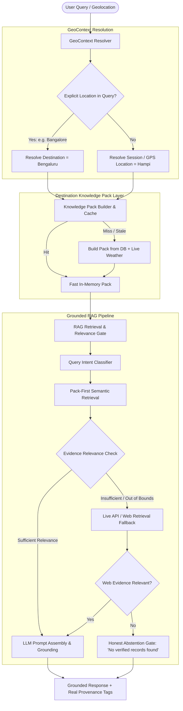

# GeoGuide Architecture Overview

## 1. System Architecture & Core Tenets

GeoGuide is a hyper-local, location-aware AI travel companion built with a strict **Grounded Retrieval-Augmented Generation (RAG)** pipeline and **Destination Knowledge Pack (GeoContext Preloading)** layer.

---

## 2. Key Architecture Layers

### A. GeoContext Resolution (`backend/knowledge_pack.py`)
- **Query Location Override**: Whenever a user asks a query containing explicit location entities (e.g. *"What is the ticket fee for Lalbagh in Bangalore?"*), the `GeoContextResolver` overrides the ambient session destination (e.g. Hampi) to prevent context pollution and cross-destination hallucination.
- **Hierarchical Detection Precedence**:
  1. `explicit_query` (Highest priority, confidence: 0.99)
  2. `user_selection` (Destination picked in UI, confidence: 0.95)
  3. `gps` (Closest destination within geographic radius, confidence: 0.92)
  4. `fallback_default` (Default canonical destination, confidence: 0.70)

### B. Destination Knowledge Pack (`backend/knowledge_pack.py`)
Preloads a compact, self-contained knowledge pack containing:
1. **POIs & Attractions**: Monuments, temples, heritage sites with coordinates, ticket fees, timings, and wheelchair accessibility.
2. **Semantic Knowledge Base**: Verified facts, historical summaries, architectural details.
3. **Safety & Travel Advisories**: Heat alerts, river safety, dress codes.
4. **Live Weather & Daylight**: Dynamic snapshot with sunrise, sunset, temperature, and UV advisories.
5. **Granular Section-Level TTLs**:
   - `STATIC` (30 days): Monuments, history, architecture.
   - `SLOW` (3 days): Ticketing, opening hours, accessibility.
   - `DYNAMIC` (4 hours): Temporary alerts, festivals.
   - `LIVE` (10 minutes): Weather and real-time conditions.

### C. Grounded RAG & Relevance Gate (`backend/rag_service.py`)
- **No Forced Top-K Retrieval**: Chunks retrieved with cosine distance above strict thresholds (or failing topic relevance filters) are pruned.
- **Query Intent Classification**: Differentiates between ticket fees, counts/quantities, food, timings, weather, and general history.
- **Honest Abstention**: When no verified data exists in either local packs or web retrieval, the system explicitly states the absence of verified records rather than inventing plausible answers.
- **Real Provenance**: Answers link directly to official ticket schedules, ASI records, Open-Meteo, or trusted Karnataka Tourism sources.
